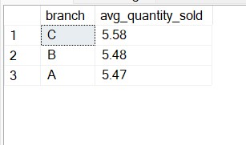

## Introduction

_image from istockphoto.com_

In this project, I embarked on an insightful journey involving the analysis of a retail sales dataset utilizing SQL. This dataset offered abundant valuable information concerning sales transactions, intricate product attributes, customer behavioral patterns, and more. The overarching aim was to effectively employ SQL queries and aggregate functions to extract meaningful insights from the dataset. These insights, in turn, facilitated the derivation of informed conclusions that held the potential to provide actionable guidance for strategic business decisions.

## Dataset Overview

The dataset consisted of several vital columns including:
- Invoice ID
- Branch
- City
- Customer type
- Gender
- Product line
- Unit price
- Quantity
- Tax 5%
- Total
- Date
- Time
- Payment
- COGS (Cost of Goods Sold)
- Gross margin percentage
- Gross income
- Rating

## Project Goals
Our project pursued two primary objectives:
1. To showcase adeptness in formulating SQL queries and effectively employing aggregate functions for dissecting real-world datasets.
2. To extract meaningful and actionable insights from the dataset, contributing pivotal information to steer business strategies and enhance decision-making processes.

## Methodology

The supermarket sales dataset was imported into the Project database on Microsoft SQL Server Management Studio.
The project objectives were successfully met by developing a carefully crafted set of SQL queries. These queries were strategically constructed to address various facets of the dataset, enabling us to uncover specific insights. Detailed comments accompanied each query, elucidating the rationale behind its formulation. By skillfully incorporating appropriate aggregate functions, employing precise grouping techniques, and utilizing systematic data ordering, I effectively aggregated and summarized the dataset, yielding meaningful and actionable results.

## SQL Queries and Analysis

--1. How many invoices are there in the dataset?

	SELECT DISTINCT COUNT (Invoice_ID) AS num_of_invoices
	FROM supermarket_sales;

The total number of invoices is 1,000. This helps in understanding the volume of transactions or sales recorded by the store. Analyzing the number of invoices provides insights into the business activity of the store.

--2. What is the total quantity of products sold?

	SELECT SUM(quantity) AS total_quantity_sold
	FROM supermarket_sales;

       
The total quantity of goods sold across the product lines by the supermarket was 5,510. This shows the overall view on the volume of sales for all products and helps to understand the demand for the products. 

--3. What is the average unit price of products sold?

SELECT ROUND(AVG(Unit_price), 2) AS avg_unit_price

FROM supermarket_sales;

The average unit price of products sold is the average price at which each unit of product is sold. This helps in understanding the typical price point at which customers are buying a product.

--4. What is the total gross income?

	SELECT ROUND(SUM(gross_income), 2) AS total_gross_income
	FROM supermarket_sales;

The total gross income was $15,379.37

--5. What is the highest unit price among the products?

	SELECT MAX(Unit_price) AS highest_unit_price
	FROM supermarket_sales;

This query shows the maximum value for a product in the store. 99.96 was the maximum unit price across all the product lines. 

--6. What is the lowest unit price among the products?

	SELECT MIN(Unit_price) AS lowest_unit_price
	FROM supermarket_sales;

This query shows the minimum value for a product in the store. 10.08 was the minimum unit price across all the product lines.

--7. What is the average gross margin percentage?

	SELECT ROUND(AVG(gross_margin_percentage), 2) AS avg_gross_mp
	FROM supermarket_sales;

The gross margin percentage represents the profit margin specifically for each product the store sold. The query above retrieves the average gross margin percentage which is 4.7619.

--8. What is the total gross margin percentage for each customer type?

	SELECT Customer_type, ROUND(SUM(gross_margin_percentage), 2) AS total_gross_mp
	FROM supermarket_sales
	GROUP BY Customer_type
	ORDER BY total_gross_mp;

The query groups the data by customer type and calculates the gross margin percentage for each customer type.

 --9. What is the total tax amount for each branch?

  SELECT branch, ROUND(SUM(tax_five_percentage), 2) AS total_tax
  FROM supermarket_sales
  GROUP BY branch
  ORDER BY total_tax DESC;

The query groups the data by branch and calculates the total tax for each branch. The tax revenue generated by each branch was retrieved.

--10. What is the average rating for each product line?

	SELECT product_line, ROUND(AVG(rating), 2) AS avg_rating
	FROM supermarket_sales
	GROUP BY product_line
	ORDER BY avg_rating DESC;

 

 Rating is the customer reviews for products sold by the store. Customer ratings can provide valuable insights into how well-received certain products are by customers and can influence purchasing decisions. This query provides insight into customer preferences and overall product performance.

 --11. What is the total revenue for each product line, considering both unit price and quantity?

	SELECT Product_line, ROUND(SUM(Unit_price*Quantity), 2) AS total_revenue
	FROM supermarket_sales
	GROUP BY product_line
	ORDER BY total_revenue DESC;

  

  The query retrieves the product line and total revenue generated by each group. Unit price multiply by quantity of each product sold give the total Revenue for each product line.  

  --12. What is the average quantity sold for each branch?

	SELECT branch, ROUND(AVG(quantity), 2) AS avg_quantity_sold
	FROM supermarket_sales
	GROUP BY branch
	ORDER BY avg_quantity_sold DESC;

  

  The query groups the data by branch and calculates the average quantity sold for each branch. Average quantity sold helps to understand the typical demand for a particular product and this can help the store plan inventory levels, manage demands, and make informed decisions about product offerings and promotions.

  --13. For each gender, what are the total gross income and total tax amount?

SELECT Gender, ROUND(SUM(gross_income),2) AS total_gross_income,     ROUND(SUM(tax_five_percentage),2) AS total_tax_amount
	FROM supermarket_sales
	GROUP BY Gender
	ORDER BY total_gross_income DESC;  

   

   This calculates the average gross income and total tax paid by each gender category to understand if there are any differences in purchasing behavior between genders.

--14. What are the average unit price and average quantity sold for each product line?

  SELECT Product_line, ROUND(AVG(Unit_price), 2) AS avg_unit_price, ROUND(AVG(Quantity), 2) AS avg_quantity_sold
	FROM supermarket_sales
	GROUP BY Product_line
	ORDER BY avg_unit_price DESC;

  

  The query groups the data by Product line and shows the average unit and average quantity sold for each product line. This provides insights into product performance and revenue generation.

  --15. What is the total gross income for each payment method and customer type combination?

	SELECT payment, customer_type, SUM(gross_income) AS total_gross_income
	FROM supermarket_sales
	GROUP BY payment, customer_type
	ORDER BY total_gross_income DESC;

  

  This shows the revenue generated by each payment method and the payment methods that are mostly used by customers. This will help the store understand customer preferences and potentially optimize payment processing.

## INSIGHTS
1.	Total Revenue by Product line

The highest revenue was generated from the Food and Beverages product line which suggests that this particular category is the most popular among consumers. Foods and beverages are the primary needs of man. The lowest revenue was recorded in the Health and Beauty product category and there is room for improvement in the marketing strategies for these products. 

2.	Branches' performance

Branch C recorded the highest average quantity sold and Branch A recorded the lowest.
The high average quantity sold in Branch C could be due to factors like location, product assortment, or effective sales strategies. Analyzing the practices of Branch C could provide valuable insights into what leads to higher sales quantities. 

3.	Gender purchasing pattern
Females are the highest purchaser of the products while males are the lowest. The observation that females are the highest purchasers while males are the lowest could be indicative of specific preferences or targeted marketing efforts. Understanding the reasons behind these purchasing patterns can help tailor marketing strategies to appeal more effectively to male customers. It's also crucial to avoid any gender biases and ensure that both male and female customers feel equally valued and catered to.

4.	Payment Method Preferences
 Cash is the most preferred payment method among the customers followed by Ewallet and credit card. The dominance of cash as the preferred payment method might be influenced by factors such as the region's economic conditions, customer demographics, or cultural norms. Ewallets and credit cards being the next preferred methods show a trend towards digital and cashless transactions. This information highlights the importance of providing diverse payment options to cater to different customer preferences and enhance convenience.

## RECOMMENDATIONS

1.	The store should capitalize on the popularity and essential nature of high selling product line by exploring opportunities to introduce premium or innovative offerings.
2.	Investigate successful factors (location, assortment, sales tactics) in Branch C and consider replicating them in other branches.
3.	Acknowledge the dominance of cash and consider providing incentives for customers to transition towards digital payment methods. 
4.	Tailor marketing strategies to target male customers more effectively while maintaining a focus on female preferences.

You can also interact with the interactive dashboard I designed at the end of this project [here](https://app.powerbi.com/view?r=eyJrIjoiNGI5NmYyZjYtZDljMy00YWQ3LTgxYmYtNTVkMjc1MmNiNjIyIiwidCI6ImY1OWE1ZDBkLThmNDEtNGNhNS05MmE5LTI3MDM1ZjMwNDZiOCJ9)

